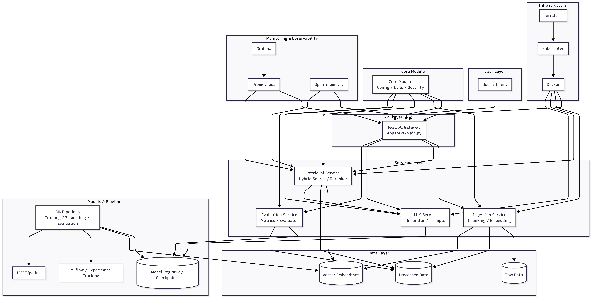

# Production-Grade Rag Platform

## Features
- Scalable RAG System (kubernetes)
- LLM Observability (Prometheus + Grafana)
- Evaluation pipeline (RAG metrics)
- CI/CD Deployment

## Architecture

## Tech Stack
- FastAPI
- Qdrant
- MLflow
- -Kubernetes
- -Prometheus
